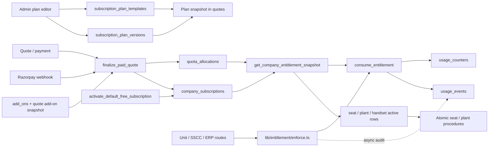

# RxTrace Quota Allocation & SaaS Cost Architecture Review

**Scope:** repository snapshot reviewed read-only on 2026-09-28. This report describes checked-in application code and ordered Supabase migrations. No live database was queried; therefore “active” means the latest migration/runtime references indicate active, not verified production deployment state.

## 1. Executive Summary

RxTrace has converged on a single entitlement interface (`get_company_entitlement_snapshot`, `consume_entitlement`, and `refund_entitlement`) that could serve FREE, STARTER, GROWTH, and ENTERPRISE. The latest migration creates a zero-quota FREE template/version and default-subscription helper, so FREE is represented by the same `company_subscriptions` architecture; it is not a completely separate billing system.

The engine is not yet robust enough to be called a reliable single source of truth without further design work. The most important issue is a usage-ledger mismatch: the latest snapshot (migration `20260927090000`) calculates code-label usage from `usage_events`; the canonical consumer last defined in `20260306123000` increments both `usage_counters` and `usage_events`, but later `20260306133000` disables the aggregation trigger and the consumer has no checked-in later redefinition. Application `trackUsage` also writes `usage_events` asynchronously after a successful RPC. This makes event rows capable of representing usage more than once, while failures can leave them missing; capacity and API usage mappings have similar inconsistencies. The snapshot can therefore disagree with the atomic consumer’s quota check.

Subscription and allocation configuration are database-backed and versioned, but capacity/resource names and pricing still have hardcoded mappings and assumptions. Monthly and yearly periods are represented; yearly subscriptions receive one annual allocation valid to period end, and the reviewed code does not divide it into monthly grants. Rollover is not established by the current canonical flow. Expiry is timestamp-based. There is no inspected scheduler that resets quotas; window movement is driven by activation/renewal processing.

**Readiness:** suitable as a foundation after resolving consumption/accounting source-of-truth and lifecycle idempotency issues. Not production-ready for a zero-surprise FREE launch or cost-based pricing until the risks in §9 are addressed and validated against deployed schema.

## 2. Quota Architecture Diagram

Important qualification: latest snapshot uses `quota_allocations` for limits and `usage_events` for code-label usage; consumer mutation still writes `usage_counters` and `usage_events`. The async `trackUsage` write is another event path. See §9.

## 3. Database Relationship Report

| Object | Purpose; writers/readers | Status | FREE safety |
|---|---|---|---|
| `subscription_plan_templates` | Plan identity, billing cycle, provider plan/pricing metadata. Admin API edits; checkout resolves; subscriptions reference it. | Active catalog (`20260301170000`, admin route). | Yes; FREE template allows nullable `razorpay_plan_id` in `20260927090000`. |
| `subscription_plan_versions` | Versioned plan quota/capacity values (`unit/box/carton/pallet/seat/plant/handset_limit`). Admin edits and checkout snapshots read it. | Active catalog. | Yes; zero limits are valid. |
| `company_subscriptions` | Company’s current plan, status, provider, billing cycle/window. Finalizer/webhook/default helper write; snapshot and summary read. | Active. | Yes; latest migration uses same table for FREE. |
| `quota_allocations` | Dated ledger rows: company, source, quota type, resource, amount, expiry, quote provenance/metadata. Quote finalization writes; snapshot and seat breakdown read. | Canonical allocation source in latest snapshot and finalizer. Schema introduced in `20260314120000`; latest allocation writer is `finalize_paid_quote` (`20260327133000`, with later capacity-duration version `20260328100000`). | Yes, if zero-quota rows/plan treated consistently; latest FREE activation does not create an allocation row, so snapshot correctly computes zero. |
| `entitlement_operation_log` | Idempotency and response ledger for entitlement operations. `consume_entitlement`/refund/cycle reset write; functions replay responses. | Active for consumption RPC, subject to source mismatch. | Yes. |
| `usage_counters` | Per-company/metric/window accumulated consumption and cycle reset state. RPC writes; older snapshots/fallback readers query. | Legacy/parallel relative to latest snapshot, which prefers events. Still written by `consume_entitlement`. | Can support it, but not safe while snapshot ignores it when events table exists. |
| `usage_events` | Reporting/event rows for unit/box/carton/SSCC/API. Consumer inserts; app tracking inserts async; snapshot sums unit/box/carton/SSCC. | Active reporting and latest snapshot source, but duplicate/missing-write risk. | Yes structurally; accounting consistency is not assured. |
| `company_addon_topups` | Older purchased/consumed quota top-up wallet. Earlier `consume_entitlement` spends it after base. | Legacy/parallel: latest allocation snapshot counts `quota_allocations` add-ons, not necessarily this table; old consume can still spend it. | Do not treat as canonical without reconciliation. |
| `seats`, `plants`, handset table | Actual active capacity use; snapshot counts active rows. Seat invitations and plant activation procedures enforce limits. | Active. Handset table naming has evolved (`handset`/`handsets`) across migrations. | Yes; zero means blocked. |
| `quotes`, `payment_intents`, `webhook_events`, `billing_invoices` | Immutable purchase snapshots, payment/finalization idempotency, provider event dedupe and invoices. | Active billing lifecycle. | FREE bypasses paid quote and uses default subscription activation. |
| `subscription_plans`, `plan_items`, `usage_limits`, `quota_balances`, `quota_usage_events` | Older plan authoring, counters, or balance models. Earlier migrations created them; later hard-cut/removal migrations replace or drop wallet/balance objects; compatibility helpers remain. | Legacy, or historical migration-only. | No; future work should avoid parallel authoring/enforcement. |
| Scheduler/cron | Subscription email and billing reconciliation exist; no quota-reset scheduler found. Cycle resets occur during paid finalization/RPC. | No dedicated quota job found (**Not Implemented**). | Monthly FREE reset needs a defined activation/renewal mechanism. |

### Main database relationships

`subscription_plan_templates 1—N subscription_plan_versions`; `company_subscriptions` points at a template/version; `quotes` capture plan and add-on snapshots; successful finalization upserts the subscription and inserts dated allocation rows keyed by quote; the entitlement snapshot sums non-expired rows and compares them with event usage and active capacity records. `entitlement_operation_log` protects consume/refund RPC calls by `(company_id, request_id)`.

## 4. Allocation Flow

1. Admin authors plan templates and active versions in `app/api/admin/subscription-plans/route.ts`; numeric quotas and capacity are persisted in the version table. Billing cycle is monthly/yearly on the template.
2. Checkout (`lib/billing/userCheckout.ts`) resolves template/version and add-ons, generates quote snapshots, and calculates payment. Plan pricing and quota data are separate fields/tables, though both can be included in one quote.
3. Verified payment/webhook processing calls finalization (`app/api/razorpay/webhook/route.ts`; `finalize_paid_quote` in `20260327133000_phase_a4_atomic_quote_finalization.sql`, later capacity duration behavior in `20260328100000_phase_e_capacity_duration_runtime.sql`). It writes/updates subscription period and ledger allocations in a transaction.
4. Base plan allocation values are copied from `plan_snapshot_json.quotas` and capacities from `plan_snapshot_json.capacities`; old current subscription base rows are expired at the new period start; new rows expire at period end. Quote/resource uniqueness supports retry updates.
5. Add-on snapshots are translated into resources. Variable quota and structural capacity use different duration/quantity fields. Capacity add-ons can expire after configured 30/60/90-day duration, capped at billing period end. Add-on catalog metadata and duration are database-configured.
6. The snapshot sums *all* unexpired allocations by resource; it does not filter subscription status for each allocation. Status gates overall access. The latest FREE helper creates an active zero-limit subscription row; no FREE quota allocation is added.

Starter/Growth/Enterprise are not hardcoded as code branches in entitlement math: they are catalog names with versions. Actual numerical plan values are database seed/admin data. No fixed Starter/Growth/Enterprise numbers are inferred here. **Starter, Growth and Enterprise allocation values are configurable through plan versions; no code-level tier-specific allocation policy was found.**

### Specific allocations

- **Base quotas:** copied from plan snapshot; bounded by period expiry.
- **Add-ons:** quote snapshot writes quota/capacity allocation ledger rows; billing mode and resource-key mapping are partly code-defined.
- **Seats/plants/handsets:** stored as `seats`/`plants`/`handsets` resources in allocation rows, consumed conceptually by active entity count (not decrementing an allocation balance).
- **Trial:** historical trial allocation exists in earlier migrations; latest `20260927090000` deletes trial allocation rows/tables and creates FREE instead. Current trial quotas: **Not Implemented** in latest schema/function state.

## 5. Consumption Flow

`lib/entitlement/enforce.ts` maps `UsageType` to canonical metrics and calls `consume_entitlement` through `lib/entitlement/canonical.ts`. The SQL RPC validates quantity/metric, locks the company row (and active subscription), checks idempotency key, reads snapshot, and applies usage atomically; it records the response in `entitlement_operation_log`. This protects concurrent overspend within the RPC and duplicate requests only when callers reuse the same request ID. A default random UUID means retries without a stable caller key are not deduplicated.

| Operation | Observed quota behavior |
|---|---|
| Unit QR | `app/api/unit/create/route.ts` and ERP unit ingest enforce `UNIT_LABEL`; refunds occur on later failures. Entitlement RPC is atomic; database insert/generation and quota consumption are not one encompassing transaction. |
| Box/carton/pallet SSCC | `app/api/sscc/generate/route.ts` enforces per-level types and issues compensating refunds on some failure paths. Those are multiple separate RPCs, so partial consumption/refund is possible if a later step fails. |
| CSV/bulk | ERP SSCC ingest calls `consumeEntitlementBatch`; batch loops over RPC calls, not one DB transaction. On failure, it attempts reverse-order refunds. Bulk item mapping charges pallet metric for some generic usage types; specific ERP SSCC code passes individual pallet/carton/box types. |
| API generation | `UsageType.ERP_INGEST` maps to canonical pallet quota but reporting metric `API`. Snapshot does not expose API usage/limit as a separate quota; `getCurrentUsage` hardcodes API to 0. No independent API quota is implemented. |
| Label preview | Explicitly non-consuming in `enforce.ts`. |
| Seat invitation | SQL checks active seat count under company and row locks; pending invitations do not count at database enforcement. UI summary subtracts pending invitations. Invitation acceptance activates the already pending seat without rechecking seat capacity; the reservation semantics therefore differ between create and accept. |
| Plant creation | `activate_plant_atomic` locks company, checks entitlement and inserts active plant in same transaction. Stronger atomicity than code generation. |
| Handset activation | Separate handset entitlement and activation flow; see `20260417153000_trial_handset_enforcement_and_backfill.sql` and handset-v2 routes. Requires deeper deployed-schema verification; capacity snapshot’s table name changed across migrations. |

**Atomicity verdict:** quota arithmetic and event/counter changes inside `consume_entitlement` are transactional and locked; end-to-end object creation is not generally atomic with quota consumption. Batch consumption is compensating, not all-or-nothing. Duplicate prevention is only reliable where stable request IDs are supplied and unique. Unit route supplies `requestId` at the enforce call path; review of all callers shows optional IDs, and `enforceEntitlement` generates a new UUID otherwise.

## 6. Monthly vs Yearly Behaviour

- **Monthly:** finalizer sets window start to activation time and end one month later; allocation rows expire at period end. The entitlement snapshot filters code usage by that window. On renewal/finalization the period and new allocation rows advance. No calendar-month reset is implied.
- **Yearly:** finalizer sets period end one year after start and copies the full plan quota into allocation valid to that end. **Monthly allocation inside yearly plan: Not Implemented** in the reviewed finalizer. The yearly quota is available across the year unless otherwise exhausted.
- **Reset:** `apply_cycle_reset` sets new subscription dates and zeroes legacy usage counters with idempotency. It does not itself add allocation rows. Finalization inserts new rows. No background quota reset job found.
- **Rollover:** old base rows are expired at renewal. No code implementing carry-forward of unused base quota was found in latest finalization. Earlier migrations mention rollover source, but this is not sufficient to establish active rollover. **Rollover: Not Implemented in the current canonical activation path.**
- **Add-on expiry:** timestamp-based; quota snapshot excludes `expires_at <= p_at`. Capacity duration add-ons can have shorter expiries.
- **Remaining:** snapshot computes `max(active allocation total - usage, 0)`. Capacity remaining is max(allocation total - active seats/plants/handsets, 0). It floors negative results to zero, which conceals over-consumption in display but does not repair it.

## 7. FREE Plan Compatibility Assessment

**Can FREE use the same engine?** Yes, architecturally. Latest migration inserts a FREE monthly template/version with zero limits and creates active `company_subscriptions` through `activate_default_free_subscription`; snapshot/consume use the same API. Zero quotas naturally block all metered generation while allowing no separate enforcement branch.

**Can FREE receive backend allocations?** Yes. `quota_allocations` has no inherent plan-name restriction and the same snapshot sums rows for any company. The admin bonus-quota path and allocation RPCs should be inspected/authorized carefully before offering grants; this report found no need for a separate FREE mechanism.

**Can FREE reset monthly?** Period support exists, but automatic monthly FREE renewal/reset is **Not Implemented** by the helper: it creates a subscription without explicit period dates (snapshot falls back to month start/end) and no FREE scheduler was found. A recurring policy must set/advance period boundaries and decide whether quotas are monthly or lifetime.

**Reusable functions:** `get_company_entitlement_snapshot`, `consume_entitlement`, `refund_entitlement`, `apply_cycle_reset`, `finalize_paid_quote` (paid plans/add-ons), plan template/version catalog, and `activate_default_free_subscription`.

**Future modifications required:** define FREE period lifecycle; determine FREE plan’s intended quota and capacity values; ensure activation helper is called for every eligible company and idempotent under concurrent setup; decide behavior at downgrade/expiry and for existing allocations; unify usage source so zero-plan and paid checks agree; validate RLS/service-role execution grants. The latest migration’s name says “remove trial default free subscription” but its body explicitly adds FREE and activates it for companies; treat migration body as authoritative.

## 8. Cost Structure Readiness

Plan limits live in `subscription_plan_versions`; plan cycle/name/provider amount live in `subscription_plan_templates`; add-on price, billing mode, entitlement key, metadata, and capacity duration live in `add_ons`. Checkout snapshots values so later catalog edits do not rewrite a historical quote. `lib/billing/pricing.ts` computes monetary totals from supplied amounts and coupon; it does not own quota policy.

Quotas are **configurable in the database**, but not entirely data-driven: TypeScript and SQL contain resource enums/mappings, usage-type mapping, fixed metric names, and quantity semantics. `lib/billing/addon-pricing.ts` infers add-on kind from English name patterns, which is fragile; canonical `entitlement_key` is available in DB but the helper still maps pricing by names. Pricing and entitlements are conceptually decoupled in catalog/snapshots, though Razorpay plan identity and plan price are tied to templates. Best future architecture: immutable, versioned entitlement bundle per plan (resource, amount, cadence, expiry/rollover policy), separate price/currency/tax product catalog, explicit add-on entitlement SKU records, and quote-time snapshots of both. Keep entitlements independent of plan display names and provider IDs.

## 9. Technical Risks

| Severity | Risk | Evidence / impact |
|---|---|---|
| **Critical** | Usage source divergence/duplicate event rows | Latest snapshot sums `usage_events`; consumer writes both counters and events in `20260306123000`; app enforcement additionally async-inserts events via `trackUsage`; aggregation trigger was disabled in `20260306133000`. Depending on deployed function body, a successful consume can be counted twice; a client-side event failure can also make snapshot undercount. It can deny valid quota or permit overspend. |
| **High** | Consumer and allocator schema generations may disagree | Newest snapshot reads `quota_allocations`; current consume definition still includes `company_addon_topups` and usage counters, while the snapshot’s topups are allocation rows. Confirm the deployed `consume_entitlement` definition and how add-on grants map to it. |
| **High** | Generation + consumption not one transaction | Unit/SSCC generation invokes quota RPC before/around subsequent DB work; compensation refunds are separate operations and often use newly generated IDs. Failures between consumption, code insert, and refund can orphan usage or refund too much/too little. |
| **High** | Seat invitation race/reservation mismatch | Create RPC serializes creation and counts only active users; it creates pending seat without consuming capacity. Multiple pending invitations can exceed remaining seats; acceptance does not recheck quota. UI subtracts pending, backend create does not. |
| **High** | Idempotency key not mandatory at application boundary | SQL deduplicates request IDs, but `enforceEntitlement` creates random IDs when omitted; retries then count again. Batch and refund operations generate fresh IDs. |
| **Medium** | Expired allocation rows remain stored and summed by overlapping periods | Snapshot excludes expired rows but rows are not purged by the inspected lifecycle. Storage/diagnostics grow; incorrect end timestamps can truncate or prolong grants. |
| **Medium** | Negative quota is hidden, not surfaced | Snapshot clamps remaining at zero; counters/usage can exceed allocation without an explicit alert in the canonical snapshot. |
| **Medium** | API quota is not independently modeled | `ERP_INGEST` consumes pallet, usage events report API, snapshot has no API usage field and usage helper returns API=0. This makes API cost attribution and monetization unreliable. |
| **Medium** | Seat/plant/handset allocation naming and schema drift | Resource values are plural in allocation rows; metric key singular; handset table name changes in migration history. A schema mismatch can yield zero usage or fail a function depending on applied migration/function definition. |
| **Medium** | Add-on classification relies partly on display names | `lib/billing/addon-pricing.ts` matches English name patterns; renamed catalog rows can misclassify or disappear from pricing map. |
| **Low** | Legacy quota objects/functions persist in migration history and compatibility helpers | Old balance/counter/plan paths can confuse maintenance; wallets/balances explicitly dropped in `20260312120000`, but legacy usage helpers and top-up objects remain. |

## 10. Final Architectural Recommendation

Retain one subscription and entitlement model for FREE through ENTERPRISE. Before relying on it for SaaS pricing, establish a single authoritative consumption ledger and make its read model identical to its write path. Ensure entitlement consumption, generated-code persistence, and idempotency key persistence share a transaction boundary (or a durable reservation/finalize/refund state machine). Model annual billing cadence separately from entitlement cadence so annual payment may produce monthly grants when that is the intended product. Define expiry, rollover, downgrade, cancellation, pending-seat reservation, and FREE renewal semantics as explicit policies rather than implicit date defaults.

Then run a deployed-schema audit: compare live function bodies to latest migration definitions, inspect triggers and scheduled jobs, reconcile `quota_allocations`, `company_addon_topups`, `usage_counters`, and `usage_events`, and exercise concurrent/replayed requests. FREE is compatible with the unified design; FREE reset and current accounting correctness remain unresolved. No code or database changes were made in this review.

## Evidence map

- Canonical TypeScript boundary/mappings: `lib/entitlement/canonical.ts`, `lib/entitlement/enforce.ts`, `lib/entitlement/usageTypes.ts`.
- Snapshot and consumption evolution: migrations `20260301173000_phase2_canonical_entitlement_service.sql`, `20260301174500_phase2_consume_idempotent_lock.sql`, `20260306123000_fix_entitlement_usage_source_and_events.sql`, `20260306133000_disable_usage_events_aggregation_trigger.sql`, `20260314120000_quota_allocations_entitlement_snapshot.sql`, `20260327163000_phase_b2_canonical_entitlement_cleanup.sql`, `20260927090000_remove_trial_default_free_subscription.sql`.
- Allocation/finalization: migrations `20260327133000_phase_a4_atomic_quote_finalization.sql`, `20260328100000_phase_e_capacity_duration_runtime.sql`, `app/api/razorpay/webhook/route.ts`.
- Admin/catalog and pricing: `app/api/admin/subscription-plans/route.ts`, `lib/billing/userCheckout.ts`, `lib/billing/pricing.ts`, `lib/billing/addon-pricing.ts`.
- Usage/capacity enforcement: `app/api/unit/create/route.ts`, `app/api/sscc/generate/route.ts`, `app/api/erp/ingest/unit/route.ts`, `app/api/erp/ingest/sscc/route.ts`, `app/api/user/plants/route.ts`, `app/api/user/seats/route.ts`, migrations `20260301150000_plant_hardening.sql`, `20260314133000_invite_flow_active_seat_quota.sql`.
